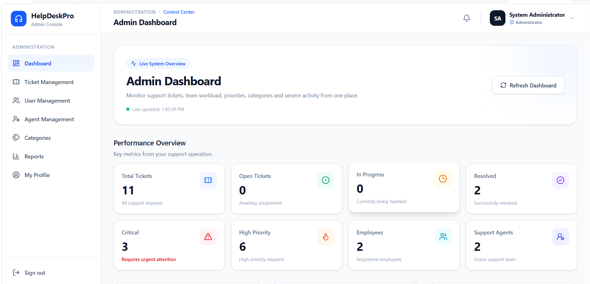
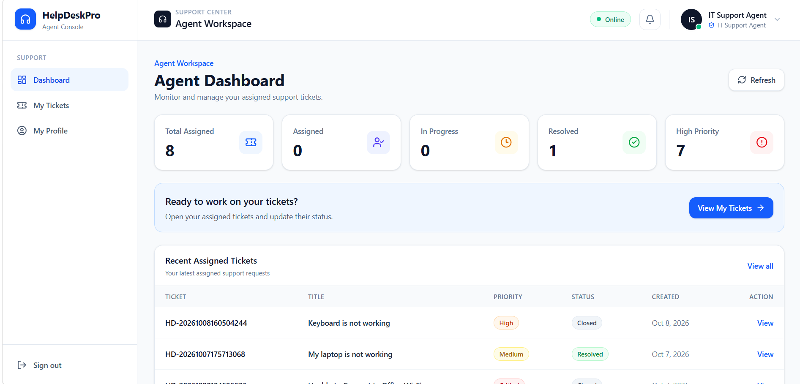
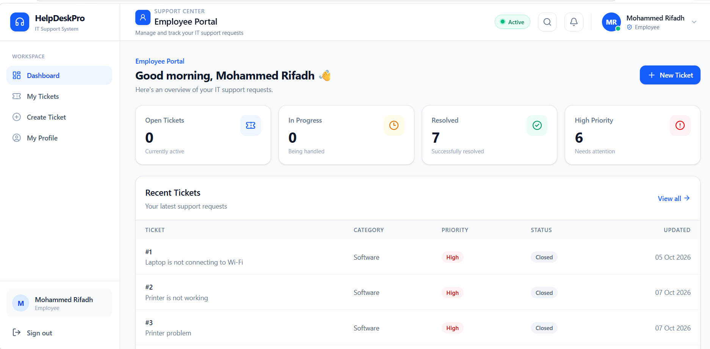

# HelpDeskPro — IT Help Desk Management System

HelpDeskPro is a full-stack IT Help Desk Management System designed to help organizations manage employee IT support requests efficiently.

## Features

* **Role-based access:** Admin, Agent, and Employee.
* **Ticket management:** Create, assign, update, resolve, and close support tickets.
* **Priority management:** Organize tickets by priority.
* **Category management:** Categorize IT support requests.
* **Dashboard:** View ticket statistics and management information.
* **Authentication:** JWT-based authentication and protected API endpoints.
* **Responsive interface:** React-based user interface.

## Technology Stack

### Backend

* ASP.NET Core Web API
* C#
* Entity Framework Core
* SQL Server
* JWT Authentication

### Frontend

* React
* Vite
* JavaScript
* Tailwind CSS
* Axios
* React Router

## Project Structure

* `HelpDeskPro/` — ASP.NET Core backend API
* `HelpDeskPro.Client/` — React frontend application

## Getting Started

1. Clone this repository.
2. Configure the SQL Server connection string in your local backend configuration.
3. Apply the required Entity Framework Core database migrations, if configured.
4. Start the ASP.NET Core API.
5. Install frontend dependencies by running `npm install` inside `HelpDeskPro.Client/`.
6. Start the frontend using `npm run dev`.

Configure your local database connection and authentication secrets before running the application. Never commit passwords or secret keys.

## Project Purpose

This project demonstrates full-stack development, REST API design, authentication, role-based authorization, database integration, and frontend development.

## Author

**Mohammed Rifadh**

Aspiring Software Engineer | C# | ASP.NET Core | React | SQL Server

## Application Screenshots

### Admin Dashboard

### Agent Dashboard

### Employee Dashboard

